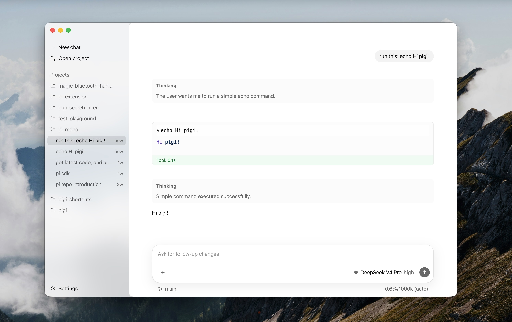

<p align="center">
  
</p>

<p align="center">
  
  
</p>

<h1 align="center">pigi</h1>

<p align="center">
  <strong>A sleek desktop GUI for <a href"https://pi.dev">pi</a></strong>
</p>

---

## Features

- Clean, native UI that stays out of your way
- Faithful to the original pi experience
- Respects your pi config — picks up models, skills, and settings automatically
- Built with performance in mind, no compromises



## Install

Download the latest build from [Releases](https://github.com/mingxinwei/pigi/releases).

## Develop

```bash
npm install
npm run dev
```

Build for distribution:

```bash
npm run build:mac
```

## License

[MIT](./LICENSE)
