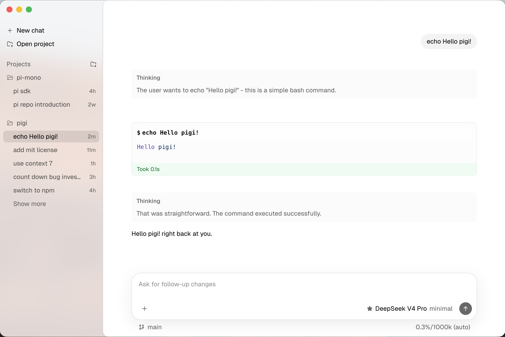

# pigi

*A sleek, high-performance GUI for pi.*

pigi is a desktop GUI for [pi](https://github.com/earendil-works/pi), the autonomous coding agent.

- Clean, elegant UI that stays out of your way.
- Faithful to the original pi experience.
- High-performance rendering, no compromises.


---

## Installation

Download the latest build from [Releases](https://github.com/mingxinwei/pigi/releases).

---

## Quick Start

```bash
npm install
npm run dev
```

Build for distribution:

```bash
npm run build:mac
```

---

## License

[MIT](./LICENSE)
